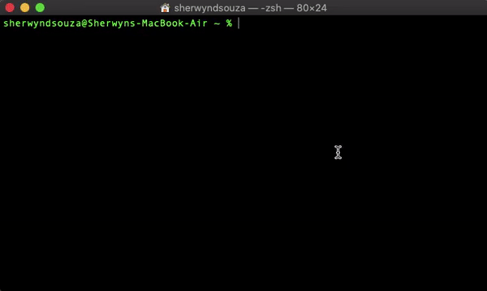

# Tweeterr 

A tool to use <b>Twitter</b> from the command line on the fly!

[](https://npmjs.org/package/tweeterr "View this project on npm")
[](https://npmjs.org/package/tweeterr "View this project on npm")<br></br>

## Demo



## Commands

| Action               | Command                            
| :------------------- | :-----------------------------------
| Get all commands     | tweeterr -h                                 
| Set Twitter keys     | tweeterr keys set      
| Tweet something      | tweeterr tweet message                                  
| Get tweets           | tweeterr show tweets                          
| Seach for tweets based on a keyword         | tweeterr search tweets         

## Getting Started

Run the command
```bash
npm i tweeterr -g
```

Set the keys & then use Tweeterr commands!

&copy; Sherwyn D'souza
